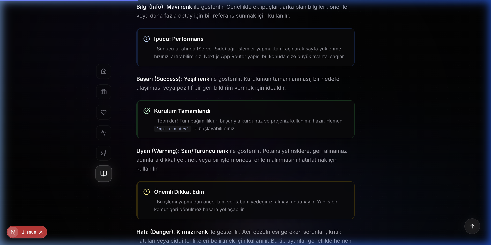

# aliakpoyraz.com 🚀

Merhaba! Burası benim internetteki küçük köşem. Bir bilgisayar mühendisliği öğrencisi olarak kendimi geliştirmek, öğrendiklerimi paylaşmak ve projelerimi sergilemek için hazırladığım kişisel web sitemin kaynak kodlarını burada bulabilirsiniz.

Sade, hızlı ve modern bir yapı kurmaya çalıştım. Hem bir blog sayfası hem de dijital bir özgeçmiş (CV) olarak işlev görüyor.


*Modern ve temiz ana sayfa tasarımı*

## 🛠 Neler Kullandım?

Bu projeyi geliştirirken modern web teknolojilerinden faydalandım:

- **Next.js 15** (App Router): React tabanlı, performanslı bir framework.
- **React 19**: En güncel React özellikleri ile UI geliştirme.
- **Tailwind CSS 4**: Modern ve hızlı stil yönetimi.
- **Lucide React**: Minimalist ve şık ikon kütüphanesi.
- **MDX**: Markdown dosyalarını React bileşenleri gibi kullanabilmek için.
- **Framer Motion** & **Intersection Observer**: Sayfa içi akıcı animasyonlar için.

## ✨ Öne Çıkan Özellikler

- **Responsive Tasarım**: Telefondan, tabletten veya bilgisayardan girdiğinizde her zaman düzgün görünür.

*Tam uyumlu mobil görünüm*
- **Dinamik Projeler**: GitHub API'sini kullanarak en son güncellediğim repoları otomatik olarak ana sayfaya çeker.
- **Gelişmiş Blog**: MDX altyapısı sayesinde sadece yazı yazmakla kalmıyor, yazıların içine özel React bileşenleri (video, uyarı kutuları, akordiyon vb.) gömebiliyorum.

*Zenginleştirilmiş blog içeriği ve özel bileşenler*
- **DarkMode**: Göz yormayan koyu tema tasarımı.
- **Performans & SEO**: Next.js'in gücüyle hızlı yüklenen sayfalar ve arama motorları için optimize edilmiş meta etiketler.

## 📁 Proje Yapısı

```text
/
├── app/            # Sayfalar, API rotaları ve global stiller
├── components/     # Tekrar kullanılabilir React bileşenleri
├── content/        # .mdx formatındaki blog yazıları
├── lib/            # Yardımcı fonksiyonlar (MDX işleme, animasyonlar vb.)
├── public/         # Resimler, favicon ve statik dosyalar
└── tailwind.config.js # Stil yapılandırması
```

## 🚀 Yerelde Çalıştırma

Projeyi kendi bilgisayarınızda çalıştırmak isterseniz şu adımları izleyebilirsiniz:

1. Bu depoyu klonlayın:
   ```bash
   git clone https://github.com/aliakpoyraz/aliakpoyraz.com.git
   ```

2. Proje dizinine girin:
   ```bash
   cd aliakpoyraz.com
   ```

3. Bağımlılıkları yükleyin:
   ```bash
   npm install
   ```

4. Geliştirme sunucusunu başlatın:
   ```bash
   npm run dev
   ```

Artık tarayıcınızda `http://localhost:3000` adresine giderek siteyi görebilirsiniz.

## 📝 Blog Yazma Süreci

Blog yazılarımı `content/` klasörü altına `.mdx` dosyaları olarak ekliyorum. Her yazının başında şöyle bir yapı (frontmatter) bulunuyor:

```markdown
---
title: "Yazı Başlığı"
date: "24-03-2026"
description: "Yazı hakkında kısa bir özet"
---
```

İçerik kısmında standart Markdown kullanabildiğim gibi, hazırladığım `<Callout>` veya `<YouTubeCard>` gibi özel bileşenleri de kullanabiliyorum.


*Zenginleştirilmiş blog içeriği ve özel bileşenler*

## 🤝 İletişim

Sorularınız veya önerileriniz için benimle GitHub üzerinden veya web sitesindeki sosyal medya linklerim aracılığıyla iletişime geçebilirsiniz.

---
⭐ Eğer bu projeyi beğendiyseniz yıldız vermeyi unutmayın!
